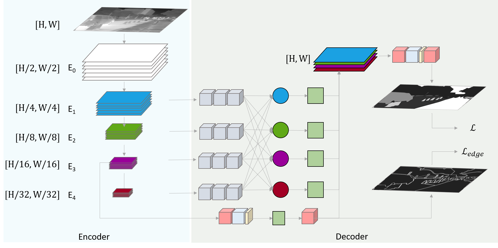

[](https://paperswithcode.com/sota/thermal-image-segmentation-on-soda-dataset?p=ftnet-feature-transverse-network-for-thermal)

[](https://paperswithcode.com/sota/thermal-image-segmentation-on-scut-seg?p=ftnet-feature-transverse-network-for-thermal)

[](https://paperswithcode.com/sota/thermal-image-segmentation-on-mfn-dataset?p=ftnet-feature-transverse-network-for-thermal)

# FTNet

This repository is an official PyTorch implementation of the paper **" [FTNet: Feature Transverse Network for Thermal Semantic Segmentation](https://ieeexplore.ieee.org/abstract/document/9585453) "**


We provide scripts for the models from our paper. You can train your own model from scratch, or use pretrained models for testing.

## FTNet Model Weights

Model weights are provided for ResNeXt50 and ResNeXt101.
Note: if you use develop branch, then will have to download the rev-2 folder since it has been updated with the latest pytorch lightning package
For user convenience, the Thermal Cityscape pretrained model and weights for all datasets are provided [here](https://tufts.box.com/s/deghum7pn6h25jn4sbdzqcjbzdt789ga).

This link also provides the semantic maps generated during testing phase.

## Highlight:

- Completely Built on Pytorch Lightning with well designed code structures. This comes with built in DistributedDataParallel, DataParallel support.
- All initialization models, trained models and predictions are available.
- Can be easily used to plug in new models with minimal changes.

## Requirements

- Hardware: 1 - 2 GPUs (better with >=11G GPU memory)
- Python 3.10
- Pytorch ==2.2.2+cu11
- Poetry 1.8.3

## Code

Clone this repository into any place you want.

```bash
git clone https://github.com/shreyaskamathkm/FTNet.git
cd FTNet
```

## Dependencies

Please run the following to meet the requirements of the model

```
poetry install
```

For developer

```
poetry install --with dev
pre-commit install
```

## Setting up the environment for training and testing

We train and test the models on three dataset:

- [SODA Dataset](https://arxiv.org/abs/1907.10303) which can be downloaded from [here](https://drive.google.com/drive/folders/1ZF2vDk9j69kP5U0zcp-liOBk-atWcw-5).
- [MFN Dataset](https://ieeexplore.ieee.org/document/8206396) which can be downloaded from [here](https://www.mi.t.u-tokyo.ac.jp/static/projects/mil_multispectral/). Their github repo can be found [here](https://github.com/haqishen/MFNet-pytorch)
- [SCUT-Seg Dataset](https://www.sciencedirect.com/science/article/abs/pii/S1350449520306769)  which can be downloaded from [here](https://drive.google.com/drive/folders/1soPrrx2_AXNzbrlOE89i5aYb3TxbmcB5). Their github repo can be found [here](https://github.com/haitaobiyao/MCNet)

### Extracting Dataset

Please download all the datasets from the link provided above. Once downloaded, run the following commands to get the dataset into the following data structure.

For simplicity sake, consider all the images are downloaded to a folder name `data/original`. The rest of the steps are as follows

For Cityscapes thermal dataset

```
python -m ftnet.helper.folder_mapping.cityscape_folder_map  --input-image-path ./data/original/SODA/TIR_leftImg8bit/ --save-path ./data/processed_dataset/
```

For SODA thermal dataset

```
python -m ftnet.helper.folder_mapping.soda_folder_map  --input-image-path ./data/original/SODA/InfraredSemanticLabel/ --save-path ./data/processed_dataset/
```

For SCUTSeg thermal dataset

```
python -m ftnet.helper.folder_mapping.scutseg_folder_map  --input-image-path ./data/original/scutseg/ --save-path ./data/processed_dataset/
```

For MFN thermal dataset

```
python -m ftnet.helper.folder_mapping.mfn_folder_map  --input-image-path ./data/original/ir_seg_dataset --save-path ./data/processed_dataset/
```

### Generating Edges

Please Note: Current implementation requires MATLAB to generate edges.

```
cd Codes/src/datasets/edge_generation/
Change the path in the 'main.m' file and run it to generate edges
```

Python implementation is provided as well, however, this has not been tested rigorously

```
python -m ftnet.data.edge_generation.generate_edges  --datasets cityscape,soda,scutseg,mfn --save-path ./data/processed_dataset/ --radius 2,1,1,1
```

#### Dataset Structure

Once the extracting and edge generation is completed, the dataset looks similar to the structure provided below:

```
├── ...
├── processed_dataset                                            # Dataset Folder
│   ├── cityscape
│           ├── edges
│   	        ├── train
│   	        ├── val
│   	        └── test
│   	    ├── image
│   	        ├── train
│   	        ├── val
│   	        └── test
│   	    └── mask
│   	        ├── train
│   	        ├── val
│   	        └── test
│   ├── SODA
│           ├── edges
│   	        ├── train
│   	        ├── val
│   	        └── test
│   	    ├── image
│   	        ├── train
│   	        ├── val
│   	        └── test
│   	    └── mask
│   	        ├── train
│   	        ├── val
│   	        └── test
│   ├── MFNDataset
│           ├── edges
│   	        ├── train
│   	        ├── val
│   	        └── test
│   	    ├── image
│   	        ├── train
│   	        ├── val
│   	        └── test
│   	    └── mask
│   	        ├── train
│   	        ├── val
│   	        └── test
│   ├── SCUTSEG
│           ├── edges
│   	        ├── train
│   	        └── val
│   	    ├── image
│   	        ├── train
│   	        └── val
│   	    └── mask
│   	        ├── train
│   	        └── val
└── ...
```

The new processed dataset will be used for training purposes. You can now train FTNet by yourself. Please update the [toml](ftnet/cfg/) files accordingly.

To run the code
'''

'''

<!-- LICENSE -->

## License

Please read the LICENSE file in the repository

## Citation

If you find the code or trained models useful, please consider citing:

```
@ARTICLE{9585453,
author={Panetta, Karen and Shreyas Kamath, K. M. and Rajeev, Srijith and Agaian, Sos S.},
journal={IEEE Access},
title={FTNet: Feature Transverse Network for Thermal Image Semantic Segmentation},
year={2021},
volume={9},
number={},
pages={145212-145227},
doi={10.1109/ACCESS.2021.3123066}}
```

<!-- ACKNOWLEDGEMENTS -->

## References

- [Pytorch Lightning](https://www.pytorchlightning.ai/)
- [Semantic Segmentation on PyTorch](https://github.com/Tramac/awesome-semantic-segmentation-pytorch)
- [Edge Detection](https://github.com/Lavender105/DFF/blob/152397cec4a3dac2aa86e92a65cc27e6c8016ab9/lib/matlab/modules/data/seg2edge.m)
- [Progress Bar](https://github.com/zhutmost/neuralzip/blob/master/apputil/progressbar.py)
- [Multi Scale Training](https://github.com/CaoWGG/multi-scale-training)
- [Metrics](https://github.com/mseg-dataset/mseg-semantic)
- [ResNet variants](https://github.com/zhanghang1989/ResNeSt)
- [Logger](https://detectron2.readthedocs.io/en/latest/_modules/detectron2/utils/logger.html)
